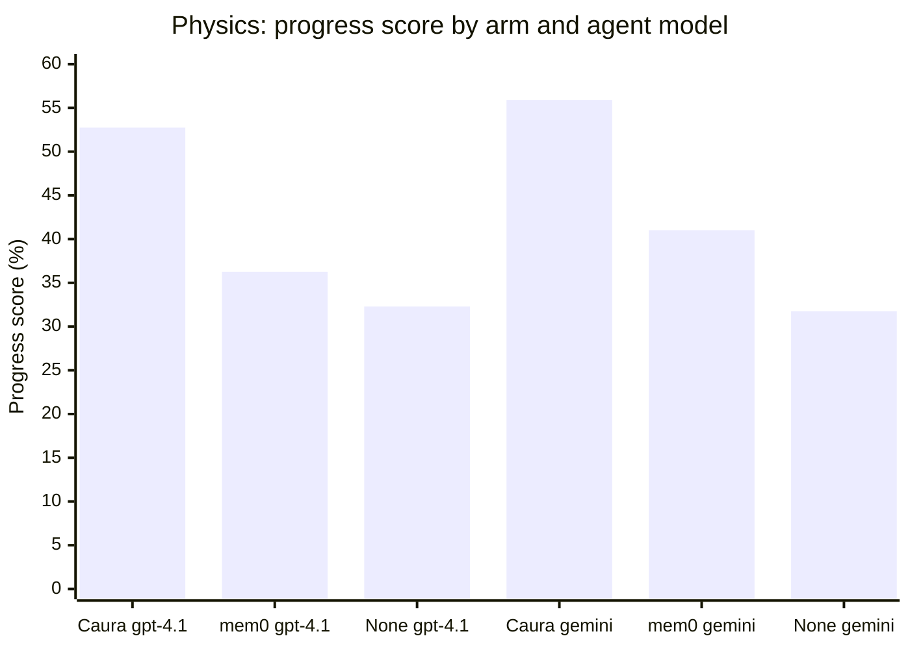
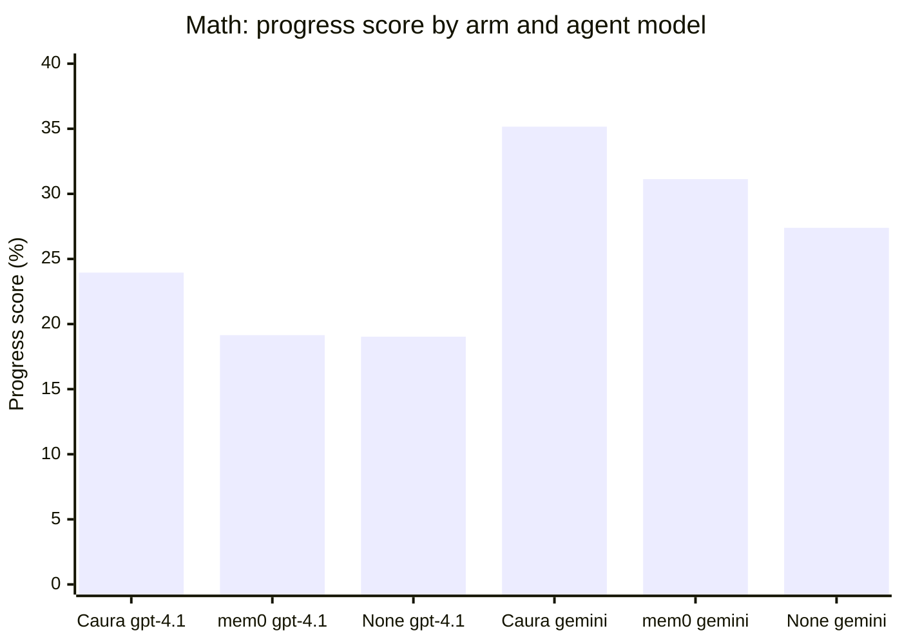
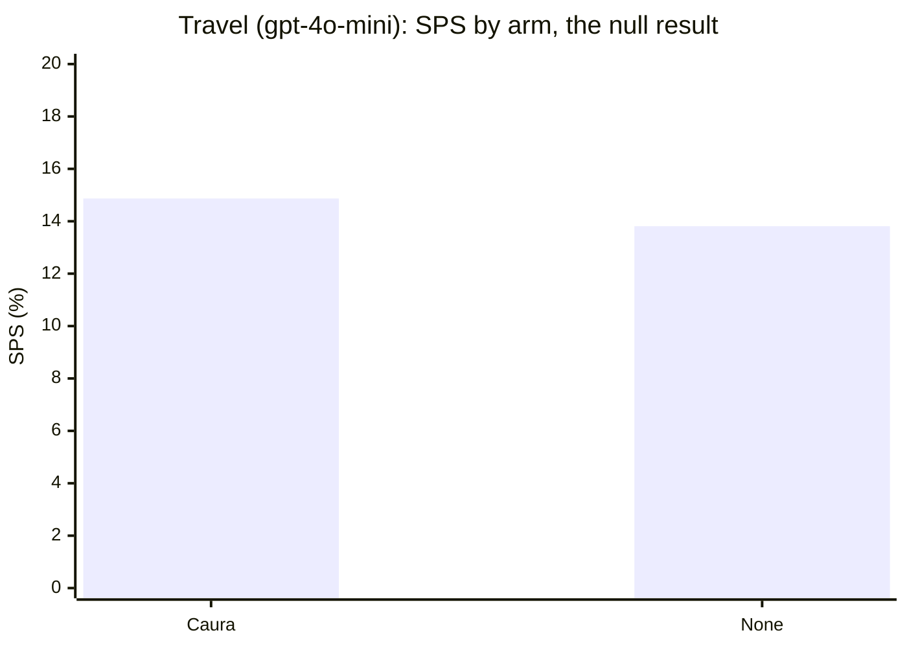

# caura-benchmarks

*(Formerly `memclaw-benchmarks`. [Caura](https://caura.ai) is the rebrand of
MemClaw: same product, same team, same API, source at
[caura-ai/caura](https://github.com/caura-ai/caura). The `memclaw_*` tool
names, env vars, and URLs still work by design, so nothing in this harness
needed a functional change, only the names in prose and the link to the
product repo.)*

Benchmark suite for [Caura](https://caura.ai): does its recall actually beat
having no memory at all, and does it hold up against public long-term-memory
QA benchmarks the rest of the field uses?

Every comparison in this repo is **paired and controlled**: Caura (the
`memclaw` arm) and each baseline (no-memory, and where possible mem0) run
the *same* items, and a gap is only reported as a finding once it clears a
bootstrap CI and a permutation or McNemar test. We also publish the negative
results, not just the wins, see Travel below. If a number here isn't backed
by a control arm and a significance test, treat it as a lead, not a result.

## What's here

| Suite | Dataset | Status |
|---|---|---|
| `suites/recall_accuracy_locomo` | LOCOMO | Scaffolded, not populated, **priority 1** |
| `suites/recall_accuracy_longmemeval` | LongMemEval | Scaffolded, not populated, **priority 1** |

Each suite runs three conditions per question (Caura recall / full-context
dump / no-memory blind) and scores answers with an LLM judge
(paraphrase-tolerant correctness, same methodology mem0's own benchmarks use).

Caura's product repo already publishes uncontrolled LoCoMo/LongMemEval
numbers (77.6% / 72.5% LLM-judge accuracy, `caura-ai/caura` →
`BENCHMARKS.md`, run 2026-04-19), but with no baseline arm, no stated sample
size, no named judge, and no significance test. The job here isn't to
reproduce those two numbers, it's to produce the paired, baselined version
that number can't stand in for. Treat 77.6% / 72.5% as a sanity-check target
for our own Caura arm, not as a finished benchmark.

## MemoryArena-Rotation (external benchmark)

Before investing further in the LOCOMO/LongMemEval datasets above, we ran
Caura against [MemoryArena](https://huggingface.co/datasets/ZexueHe/memoryarena)
(sibling repo, not part of this codebase) as an early, cheaper read on
whether memory helps at all, and, once it clearly did, added mem0 as a
third arm. See `CLAUDE.md` for full methodology, raw numbers, and caveats;
this is the summary.

### Visual comparison (progress score, %)







Each chart is one bar series read left to right; the first three bars are
gpt-4.1 (Caura, mem0, none in that order) and the next three are
gemini-3.6-flash, same order. Caura leads on every bar group in physics and
math; the travel chart is the one place the two bars are within noise of
each other, which is the point of showing it.

### Score breakdown (only cells that have actually been run)

| Domain | Agent model | Arm | Paper passrate | Avg progress score |
|---|---|---|---|---|
| Travel (50 groups) | gpt-4o-mini | Caura | SR 0.00% | SPS 14.87% (PS 0.29%) |
| Travel (50 groups) | gpt-4o-mini | None | SR 0.00% | SPS 13.81% (PS 0.29%) |
| Math (40p/354s) | gpt-4.1 | Caura | **0.250** (10/40) | **23.95%** |
| Math (40p/354s) | gpt-4.1 | mem0 | 0.100 (4/40) | 19.15% |
| Math (40p/354s) | gpt-4.1 | None | 0.100 (4/40) | 19.03% |
| Physics (20p/86s) | gpt-4.1 | Caura | **0.350** (7/20) | **52.75%** |
| Physics (20p/86s) | gpt-4.1 | mem0 | 0.100 (2/20) | 36.26% |
| Physics (20p/86s) | gpt-4.1 | None | 0.050 (1/20) | 32.29% |
| Physics (20p/86s) | gemini-3.6-flash | Caura | **0.550** (11/20) | **55.90%** |
| Physics (20p/86s) | gemini-3.6-flash | mem0 | 0.350 (7/20) | 41.01% |
| Physics (20p/86s) | gemini-3.6-flash | None | 0.250 (5/20) | 31.76% |
| Math (40p/354s) | gemini-3.6-flash | Caura | **0.350** (14/40) | **35.16%** |
| Math (40p/354s) | gemini-3.6-flash | mem0 | 0.225 (9/40) | 31.13% |
| Math (40p/354s) | gemini-3.6-flash | None | 0.225 (9/40) | 27.39% |

"Caura" above is the `memclaw` arm in the raw result directories and
`CLAUDE.md` write-ups; "None" is the `none` arm. Kept as literal names there
since that's what the config/data files actually use.

With the physics mem0/gemini-3.6-flash arm now complete (2026-08-20), **both
formal-reasoning domains have all three arms run at both agent-model
families**, nothing left to run at these two tiers. Travel is closed as a
true null (see caveat below); shopping and further model tiers (Opus 5,
gpt-5.6-sol) are scoped but not run, so they're left out of this table
entirely rather than listed with a blank score.

### Significance (paired bootstrap CI + permutation, or McNemar)

| Domain | Agent model | Caura vs None | Caura vs mem0 | mem0 vs None |
|---|---|---|---|---|
| Travel (50 groups) | gpt-4o-mini | **No effect** (95% CI spans zero, p=0.45) | n/a | n/a |
| Math (40 papers / 354 subtasks) | gpt-4.1 | **Caura wins**, progress score +4.9pp (p=0.024), pass rate 10/40 vs 4/40 (p=0.031) | +4.8pp (p=0.014) | +0.1pp, n.s. (p=0.94) |
| Physics (20 papers / 86 subtasks) | gpt-4.1 | **Caura wins, larger effect**, progress score +20.5pp (p=0.0036), pass rate 7/20 vs 1/20 (p=0.031), Caura won every paper it didn't tie (9-0-11) | +16.5pp (p=0.0067) | +4.0pp, n.s. (p=0.45) |
| Physics (20 papers / 86 subtasks) | gemini-3.6-flash | **Caura wins, replicates & strengthens gpt-4.1**, progress score +24.1pp (p=0.0018), subtask McNemar p=4.2e-07 | +14.9pp (p=0.0346), subtask McNemar p=0.0005 | +9.3pp, trending but n.s. (p=0.170) |
| Math (40 papers / 354 subtasks) | gemini-3.6-flash | **Caura wins, replicates gpt-4.1**, progress score +7.8pp (p=0.0006), subtask McNemar p=0.0007 (paper-passrate McNemar n.s. at 0.125, known floor effect, not evidence against) | subtask McNemar p=0.040 (progress-score gap n.s.) | +3.7pp, trending but n.s. (p=0.076) |

**Takeaway:** memory only showed an effect once the agent model had headroom
to use it. gpt-4o-mini couldn't do the travel task well enough for memory to
matter regardless of condition. At gpt-4.1, Caura beat both no-memory and
mem0 on both formal-reasoning domains, and **mem0 was statistically
indistinguishable from no memory at all** in both (p=0.94, p=0.45). The
Caura-vs-none effect held and grew at a second agent model family
(`gemini-3.6-flash`), on **both** domains now: math replicated 2026-08-19,
physics's mem0 arm completed 2026-08-20, clearing the last gap in the table.
**mem0's picture at the gemini tier is consistently less clean than at
gpt-4.1, in both domains**: it trends above no-memory on math (+3.7pp,
p=0.076) and physics (+9.3pp, p=0.170), neither individually significant,
but the same direction twice is worth flagging as a possible tier-dependent
shift, not dismissing as noise, and not overclaiming as "mem0 caught up"
either. Caura still separates clearly from mem0 in physics at this tier
(p=0.0346 progress score, p=0.0005 subtask); math's Caura-vs-mem0 gap is
weaker (subtask p=0.040, progress score n.s.). Not yet tested: whether any of
this holds outside formal-reasoning-style tasks, or at gpt-4.1 on the travel
domain specifically.

**Known limitation, read before quoting absolute scores.** Every
formal-reasoning result above was produced by a single-shot reasoner, not the
tool-using agent loop the harness intends: a config bug points the tool-loop
client at the wrong API base, it 401s, and the harness silently falls back to
a plain reasoning call. This hit **every arm identically**, so the paired
Caura-vs-mem0-vs-none comparisons above are unaffected, but the absolute
progress-score and pass-rate numbers are a floor on what the agent could do,
not its real capability. Left unfixed on purpose so new model tiers stay
comparable to the existing baseline; fixing it means re-running gpt-4.1 too.

**Data-integrity note.** The gemini-3.6-flash math result above was blocked
for a week by a silent failure mode: an exhausted account balance was
swallowed as an empty "completed" response instead of a failure, so a run
could log "0 failed" while actually being contaminated. Caught by a
dedicated contamination scanner, not by the run's own exit code, see
Methodology below. Every result in this table has since been passed through
that scanner before being cited.

## Setup

```bash
pip install -r requirements.txt
export ANTHROPIC_API_KEY=...
export MEMCLAW_API_KEY=...
export MEMCLAW_BASE_URL=https://caura.ai   # or your deployment
```

`runners/memclaw_client.py` maps Caura operations to REST endpoints. The
exact paths are a best-effort guess based on the MCP tool set; verify them
against your Caura deployment's REST docs (`MEMCLAW_*_PATH` env vars let you
override any of them without touching code) before trusting results. Caura
keeps the `memclaw_*`/`MEMCLAW_*` names for backward compatibility, so none
of this needs renaming to work against a current deployment.

Datasets need populating first, see `datasets/locomo/README.md` and
`datasets/longmemeval/README.md`.

## Running

```bash
# sanity-check on a handful of questions first
python suites/recall_accuracy_locomo/run.py --condition memclaw --limit 5
python suites/recall_accuracy_locomo/run.py --condition full_context --limit 5
python suites/recall_accuracy_locomo/run.py --condition no_memory --limit 5
```

Each run writes a JSON file to `results/` with per-item detail plus an
aggregate metric, so results are diffable across runs over time.

## Methodology

A raw aggregate delta is not treated as evidence anywhere in this repo. Every
reported comparison:

- runs Caura and its baseline(s) on the **same items** (paired, not two
  independent samples);
- reports a **95% bootstrap CI** (20k resamples) and a **permutation test**
  for continuous metrics, or an **exact McNemar test** for pass/fail metrics;
- gets checked for **silently-corrupted data** before it's cited: a run
  logging "N attempted, 0 failed" only means every item wrote *a* result, not
  a *correct* one (see the data-integrity note above for why this matters in
  practice, not just in theory).

`scripts/paired_stats.py` implements the bootstrap/permutation/McNemar suite
and runs against any MemoryArena results directory:

```bash
python scripts/paired_stats.py <MemoryArena>/results/json/phys_gpt41
```

Dated write-ups with full numbers, caveats, and per-domain breakdowns live in
`reports/`.

## Other benchmark tracks

Caura is also being evaluated in three sibling repos outside this codebase's
scope, tracked in `CLAUDE.md` since state has to survive across sessions and
machines:

| Benchmark | Status |
|---|---|
| CL-Bench (`continual-learning-bench`) | Integrated as a system; a run reportedly happened but its results aren't recovered into this record yet |
| STATE-Bench | Blocked: its eval protocol locks the judge/simulator to Azure OpenAI GPT-5.4, which we don't have provisioned |
| GroupMemBench | Queued, not yet scoped |

## Repo layout

```
datasets/       public dataset caches (locomo, longmemeval)
suites/         one dir per benchmark, each with a run.py entrypoint
runners/        shared harness + Caura REST client
judges/         LLM-judge scoring
scripts/        paired-comparison statistics (bootstrap CI, permutation, McNemar)
reports/        dated result write-ups with full numbers and caveats
results/        one JSON file per run
```
