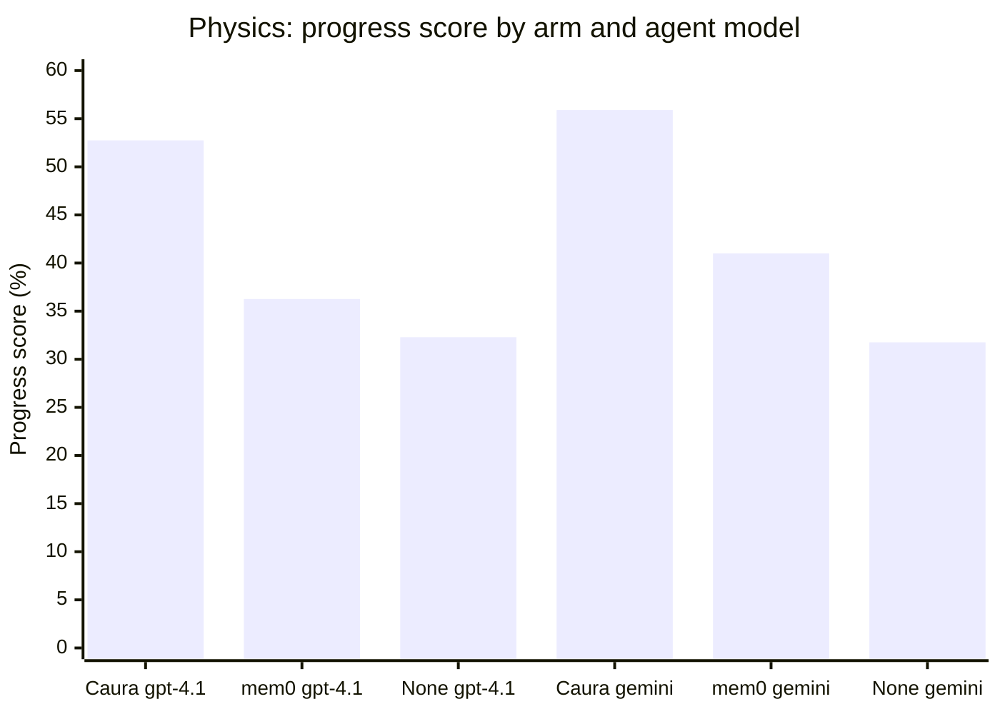
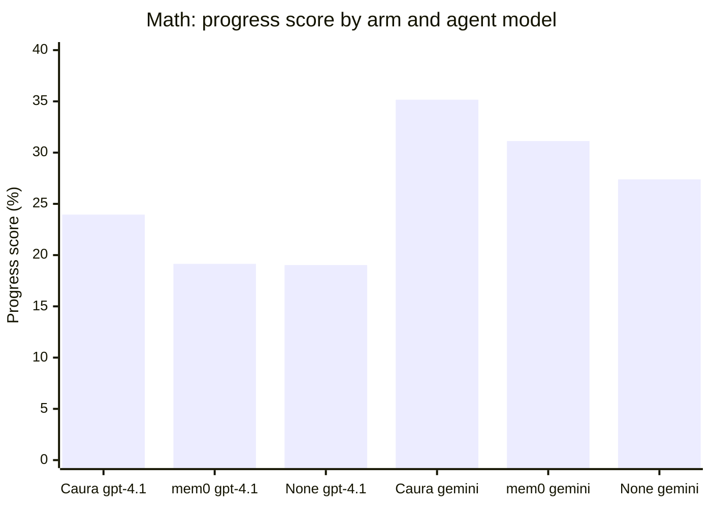
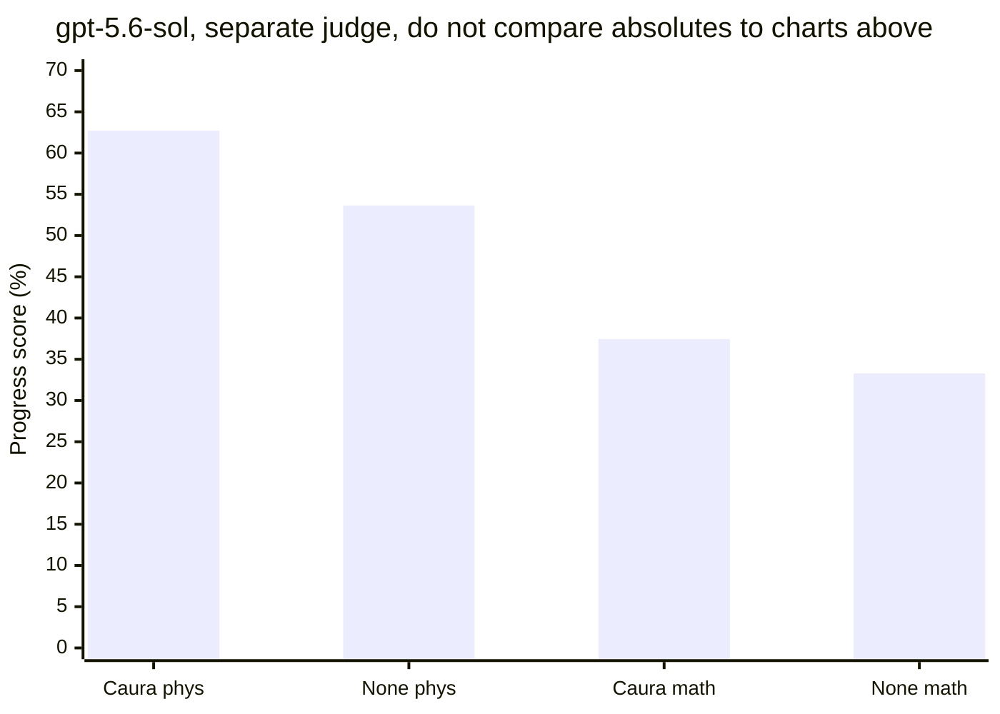
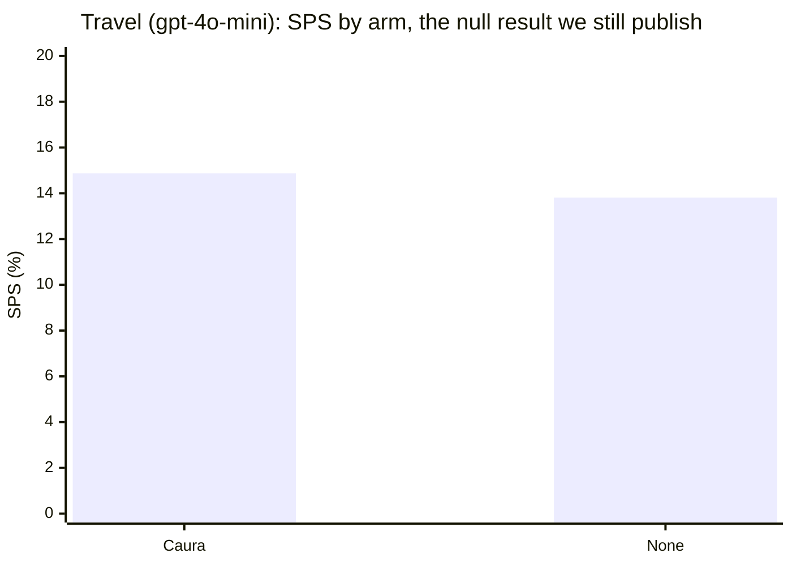

# caura-benchmarks

*(Formerly `memclaw-benchmarks`. [Caura](https://caura.ai) is the rebrand of
MemClaw: same product, same team, same API, source at
[caura-ai/caura](https://github.com/caura-ai/caura). The `memclaw_*` tool
names, env vars, and URLs still work by design, so nothing in this harness
needed a functional change, only the names in prose and the link to the
product repo.)*

Benchmark suite for [Caura](https://caura.ai): does its recall actually beat
having no memory at all, and does it hold up against public long-term-memory
QA benchmarks the rest of the field uses?

Every comparison in this repo is **paired and controlled**: Caura (the
`memclaw` arm) and each baseline (no-memory, and where possible mem0) run
the *same* items, and a gap is only reported as a finding once it clears a
bootstrap CI and a permutation or McNemar test. We also publish the negative
results, not just the wins, see Travel below. If a number here isn't backed
by a control arm and a significance test, treat it as a lead, not a result.

## What's here

| Suite | Dataset | Status |
|---|---|---|
| `suites/recall_accuracy_locomo` | LOCOMO | Scaffolded, **dropped 2026-08-25**, never populated |
| `suites/recall_accuracy_longmemeval` | LongMemEval | Scaffolded, **dropped 2026-08-25**, never populated |

Both suites were **dropped on 2026-08-25** and never populated. The
scaffolding stays in the tree (each was designed to run three conditions per
question, Caura recall / full-context dump / no-memory blind, scored by a
paraphrase-tolerant LLM judge) but no run was ever made and none is planned.

Two consequences are worth stating plainly, because they were the reasons
this work used to be priority 1:

- Caura's product repo publishes LoCoMo/LongMemEval numbers (77.6% / 72.5%
  LLM-judge accuracy, `caura-ai/caura` → `BENCHMARKS.md`, run 2026-04-19)
  with **no baseline arm, no stated sample size, no named judge, and no
  significance test**. This project will not produce the paired, controlled
  version, so those figures should keep being described as **unbaselined**
  wherever they are cited.
- **The token-efficiency question stays open.** `BENCHMARKS.md` claims 96.6%
  and 98.2% token savings against full context, while our own travel
  measurement found Caura used *more* input than the full-context-style
  control (112k vs 104k tokens per group, about 1.07x). The `full_context`
  condition in `runners/recall_accuracy.py` was the comparator that would
  have settled which holds where. Do not circulate the two sets of numbers
  side by side as though they agree.

## MemoryArena-Rotation (external benchmark)

Before investing further in the LOCOMO/LongMemEval datasets above, we ran
Caura against [MemoryArena](https://huggingface.co/datasets/ZexueHe/memoryarena)
(sibling repo, not part of this codebase) as an early, cheaper read on
whether memory helps at all, and, once it clearly did, added mem0 as a
third arm. See `CLAUDE.md` for full methodology, raw numbers, and caveats;
this is the summary.

### Headline

Caura beats no-memory on **both** formal-reasoning domains at **three** agent
model tiers spanning three model families. The effect is largest in the middle
of the capability range and hardest to measure at the top, where the no-memory
baseline itself gets much stronger.

| Agent model | Physics | Math |
|---|---|---|
| `gpt-4.1` | **+20.5pp** :white_check_mark: | **+4.9pp** :white_check_mark: |
| `gemini-3.6-flash` | **+24.1pp** :white_check_mark: | **+7.8pp** :white_check_mark: |
| `gpt-5.6-sol` | +9.1pp :warning: | +4.2pp :warning: |

:white_check_mark: significant on the headline progress score.
:warning: significant on subtask correctness only, progress score positive but
not significant. Read the gpt-5.6-sol caveat below before quoting that row.

### Visual comparison (progress score, %)

Bars read left to right as Caura, mem0, None within each model group. Higher
is better.





The `gpt-5.6-sol` tier gets its **own chart on purpose**. It ran on Azure with
a different judge model, so its absolute scores are not on the same scale as
the two charts above and must never share an axis with them. Two arms only,
no mem0 at this tier.





Caura leads every bar group in physics and math. Travel is the one place the
two bars sit within noise of each other, which is exactly why it is shown.

### Score breakdown (only cells that have actually been run)

Caura rows are bolded throughout so the winning arm is readable at a glance.

**Physics, 20 papers / 86 subtasks**

| Agent model | Arm | Paper passrate | Avg progress score |
|---|---|---|---|
| `gpt-4.1` | **Caura** | **0.350** (7/20) | **52.75%** |
| `gpt-4.1` | mem0 | 0.100 (2/20) | 36.26% |
| `gpt-4.1` | None | 0.050 (1/20) | 32.29% |
| `gemini-3.6-flash` | **Caura** | **0.550** (11/20) | **55.90%** |
| `gemini-3.6-flash` | mem0 | 0.350 (7/20) | 41.01% |
| `gemini-3.6-flash` | None | 0.250 (5/20) | 31.76% |
| `gpt-5.6-sol` | **Caura** | **0.450** (9/20) | **62.71%** |
| `gpt-5.6-sol` | None | 0.350 (7/20) | 53.64% |

**Math, 40 papers / 354 subtasks**

| Agent model | Arm | Paper passrate | Avg progress score |
|---|---|---|---|
| `gpt-4.1` | **Caura** | **0.250** (10/40) | **23.95%** |
| `gpt-4.1` | mem0 | 0.100 (4/40) | 19.15% |
| `gpt-4.1` | None | 0.100 (4/40) | 19.03% |
| `gemini-3.6-flash` | **Caura** | **0.350** (14/40) | **35.16%** |
| `gemini-3.6-flash` | mem0 | 0.225 (9/40) | 31.13% |
| `gemini-3.6-flash` | None | 0.225 (9/40) | 27.39% |
| `gpt-5.6-sol` | **Caura** | **0.300** (12/40) | **37.45%** |
| `gpt-5.6-sol` | None | 0.150 (6/40) | 33.29% |

**Travel, 50 groups (closed as a true null)**

| Agent model | Arm | Success rate | Soft progress score |
|---|---|---|---|
| `gpt-4o-mini` | **Caura** | 0.00% | 14.87% (PS 0.29%) |
| `gpt-4o-mini` | None | 0.00% | 13.81% (PS 0.29%) |

"Caura" above is the `memclaw` arm in the raw result directories and in
`CLAUDE.md`, "None" is the `none` arm. Those literal names are kept in the
data because that is what the config and result files actually use.

### Significance (paired bootstrap CI + permutation, or exact McNemar)

| Domain | Agent model | Caura vs None | Caura vs mem0 | mem0 vs None |
|---|---|---|---|---|
| Travel (50 groups) | `gpt-4o-mini` | **No effect**, 95% CI spans zero, p=0.45 | n/a | n/a |
| Math (40p/354s) | `gpt-4.1` | **Caura wins**, +4.9pp (p=0.024), passrate 10/40 vs 4/40 (p=0.031) | +4.8pp (p=0.014) | +0.1pp, n.s. (p=0.94) |
| Physics (20p/86s) | `gpt-4.1` | **Caura wins, larger effect**, +20.5pp (p=0.0036), passrate 7/20 vs 1/20 (p=0.031), Caura won every paper it did not tie (9-0-11) | +16.5pp (p=0.0067) | +4.0pp, n.s. (p=0.45) |
| Physics (20p/86s) | `gemini-3.6-flash` | **Caura wins, strongest effect measured**, +24.1pp (p=0.0013), subtask McNemar p=4.2e-07 | +14.9pp (p=0.0346), subtask McNemar p=0.0005 | +9.3pp, trending, n.s. (p=0.170) |
| Math (40p/354s) | `gemini-3.6-flash` | **Caura wins, replicates gpt-4.1**, +7.8pp (p=0.0006), subtask McNemar p=0.0007 (passrate McNemar n.s. at 0.125, a known floor effect, not evidence against) | subtask McNemar p=0.040 (progress-score gap n.s.) | +3.7pp, trending, n.s. (p=0.076) |
| Physics (20p/86s) | `gpt-5.6-sol` | **Mixed**, subtask correctness p=0.024, but progress score +9.1pp n.s. (p=0.204) and passrate n.s. (p=0.727) | n/a, no mem0 arm | n/a |
| Math (40p/354s) | `gpt-5.6-sol` | **Mixed**, subtask correctness p=0.020, but progress score +4.2pp n.s. (p=0.141) and passrate n.s. (p=0.146) | n/a, no mem0 arm | n/a |

**Takeaway.** Memory only shows an effect once the agent model has headroom to
use it, and the size of that effect is not simply increasing in model strength.
`gpt-4o-mini` could not do the travel task well enough for memory to matter in
any condition. At `gpt-4.1` and `gemini-3.6-flash`, Caura beat both no-memory
and mem0 across both formal-reasoning domains, and at `gpt-4.1` **mem0 was
statistically indistinguishable from having no memory at all** in both domains
(p=0.94, p=0.45). At the gemini tier mem0's picture is consistently less clean:
it trends above no-memory in math (+3.7pp, p=0.076) and physics (+9.3pp,
p=0.170), neither individually significant, but the same direction twice is
worth flagging as a possible tier-dependent shift rather than dismissing as
noise or overclaiming as "mem0 caught up". Caura still separates clearly from
mem0 in physics at that tier (p=0.0346 progress score, p=0.0005 subtask).

At the top tier, `gpt-5.6-sol`, the result is genuinely mixed and is reported
that way. Caura wins on subtask correctness in both domains (p=0.024 physics,
p=0.020 math), the metric with by far the most observations, but neither
paper-level progress-score gap reaches significance. The two domains disagree
about why. In physics the no-memory baseline jumps from about 32% at both
earlier tiers to 53.64%, so the gap compresses, which would suggest a strong
agent recovers what weaker agents needed memory to supply. Math does not
reproduce that: its gap barely moves from `gpt-4.1` (+4.9pp to +4.2pp) while
both arms rise together, so what changed there is the p-value rather than the
effect. The most likely cause is variance, since this tier forces agent
temperature to 1.0 (the model rejects 0.0), which widens the paired-difference
distribution. **Do not report the gpt-5.6-sol rows as a win, and do not report
them as a null.**

**Caveat specific to `gpt-5.6-sol`, read before quoting its absolute scores.**
That tier ran on Azure AI Foundry, which refuses new deployments of the
`gpt-4o-mini` judge used by every other run in this table. Its judge is
`gpt-5-mini`, measured at 88.8% agreement (71/80 stratified pairs) with the
usual judge and lopsided toward leniency by roughly +6pp, at 7 wrong-to-right
versus 2 right-to-wrong. Both arms share that judge, so the within-tier
comparison is valid, but **62.71% and 53.64% must not be placed in a table
against the gpt-4.1 or gemini-3.6-flash absolute scores**. Some of the apparent
baseline jump is judge leniency rather than agent capability.

**Known limitation, read before quoting any absolute score.** Every
formal-reasoning result above was produced by a single-shot reasoner, not the
tool-using agent loop the harness intends: a config bug points the tool-loop
client at the wrong API base, it 401s, and the harness silently falls back to a
plain reasoning call. This hit **every arm identically**, so the paired
comparisons are unaffected, but the absolute progress-score and pass-rate
numbers are a floor on what the agent could do, not its real capability. Left
unfixed on purpose so new model tiers stay comparable to the existing baseline.
Fixing it means re-running `gpt-4.1` as well.

**Data-integrity note.** The gemini-3.6-flash math result was blocked for a
week by a silent failure mode: an exhausted account balance was swallowed as an
empty "completed" response instead of a failure, so a run could log "0 failed"
while being badly contaminated. A second instance later appeared from an
unrelated cause, a reasoning model spending its entire token budget on
reasoning tokens and returning no content at all. Both were caught by a
dedicated contamination scanner rather than by any run's exit code, see
Methodology below. **Every result in these tables has been passed through that
scanner before being cited.**

## Setup

```bash
pip install -r requirements.txt
export ANTHROPIC_API_KEY=...
export MEMCLAW_API_KEY=...
export MEMCLAW_BASE_URL=https://caura.ai   # or your deployment
```

`runners/memclaw_client.py` maps Caura operations to REST endpoints. The
exact paths are a best-effort guess based on the MCP tool set; verify them
against your Caura deployment's REST docs (`MEMCLAW_*_PATH` env vars let you
override any of them without touching code) before trusting results. Caura
keeps the `memclaw_*`/`MEMCLAW_*` names for backward compatibility, so none
of this needs renaming to work against a current deployment.

Datasets need populating first, see `datasets/locomo/README.md` and
`datasets/longmemeval/README.md`.

## Running

```bash
# sanity-check on a handful of questions first
python suites/recall_accuracy_locomo/run.py --condition memclaw --limit 5
python suites/recall_accuracy_locomo/run.py --condition full_context --limit 5
python suites/recall_accuracy_locomo/run.py --condition no_memory --limit 5
```

Each run writes a JSON file to `results/` with per-item detail plus an
aggregate metric, so results are diffable across runs over time.

## Methodology

A raw aggregate delta is not treated as evidence anywhere in this repo. Every
reported comparison:

- runs Caura and its baseline(s) on the **same items** (paired, not two
  independent samples);
- reports a **95% bootstrap CI** (20k resamples) and a **permutation test**
  for continuous metrics, or an **exact McNemar test** for pass/fail metrics;
- gets checked for **silently-corrupted data** before it's cited: a run
  logging "N attempted, 0 failed" only means every item wrote *a* result, not
  a *correct* one (see the data-integrity note above for why this matters in
  practice, not just in theory).

`scripts/paired_stats.py` implements the bootstrap/permutation/McNemar suite
and runs against any MemoryArena results directory:

```bash
python scripts/paired_stats.py <MemoryArena>/results/json/phys_gpt41
```

Dated write-ups with full numbers, caveats, and per-domain breakdowns live in
`reports/`.

## Other benchmark tracks

Caura is also being evaluated in three sibling repos outside this codebase's
scope, tracked in `CLAUDE.md` since state has to survive across sessions and
machines:

| Benchmark | Status |
|---|---|
| CL-Bench (`continual-learning-bench`) | Integrated as a system. A run reportedly happened on another machine, but **zero scores are recoverable in this checkout**, so it counts as not started |
| STATE-Bench | **Unblocked as of 2026-08-26**, pending a deployment. Its eval protocol locks the judge and user-simulator to Azure OpenAI GPT-5.4. The Azure resource now carries `gpt-5.4` in its catalog but has not deployed it yet, which is a portal action rather than a procurement problem |
| GroupMemBench | Queued, not yet scoped |
| MemoryArena shopping | Deferred. Needs a multi-GB product database, a JDK, spacy `en_core_web_lg`, and a separate upstream service |

## Repo layout

```
datasets/       public dataset caches (locomo, longmemeval)
suites/         one dir per benchmark, each with a run.py entrypoint
runners/        shared harness + Caura REST client
judges/         LLM-judge scoring
scripts/        paired-comparison statistics (bootstrap CI, permutation, McNemar)
reports/        dated result write-ups with full numbers and caveats
results/        one JSON file per run
```
