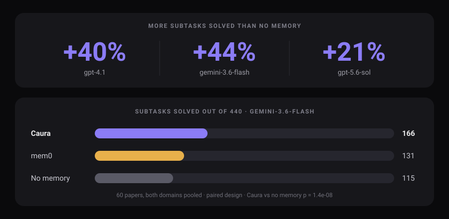
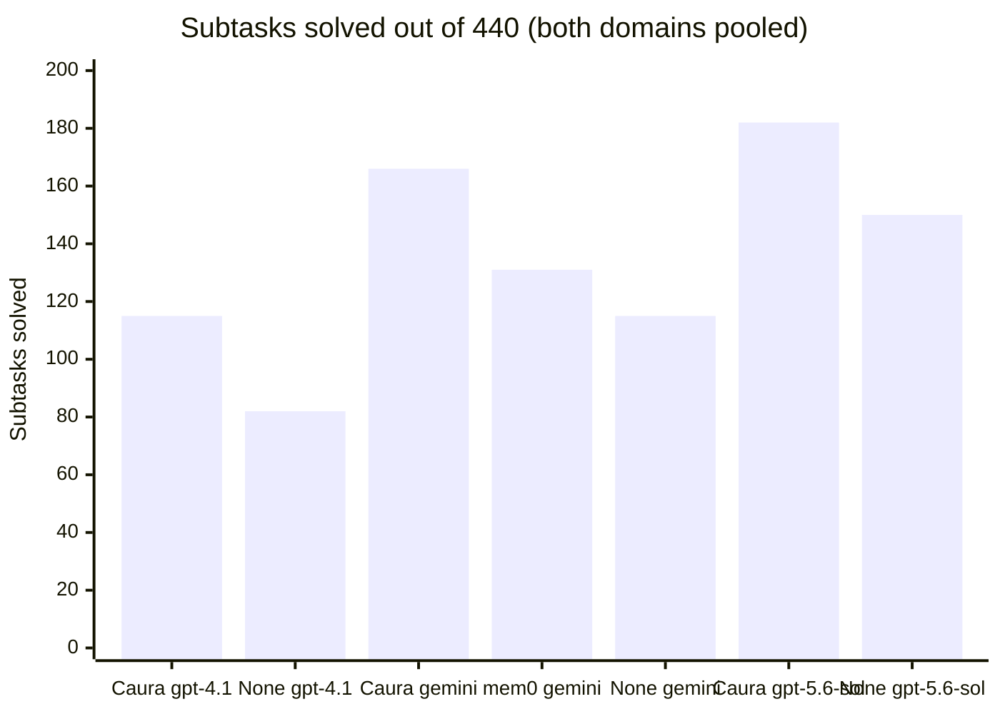
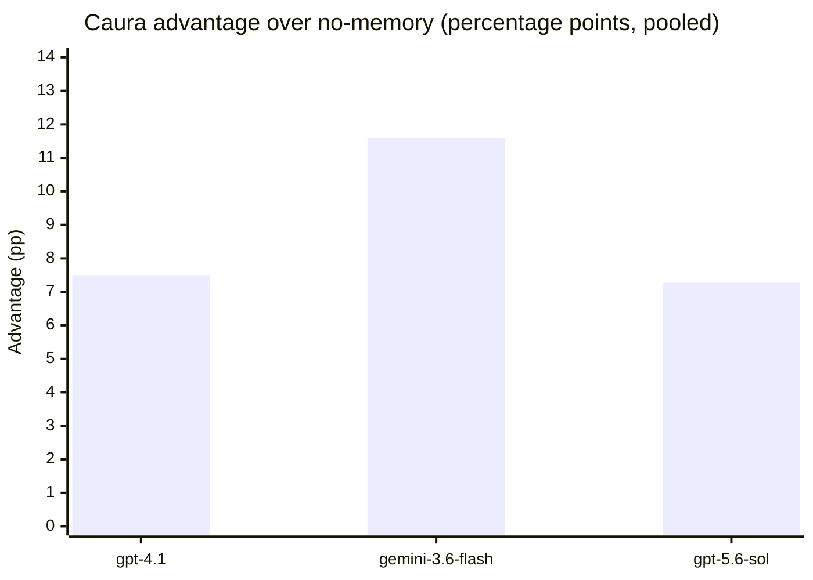

# caura-benchmarks

**Does giving an AI agent long-term memory actually make it better at its
job?** This repo answers that with paired, controlled, significance-tested
benchmarks of [Caura](https://caura.ai) against no-memory and mem0 baselines.

**Short answer: yes.** Caura beats no memory at every agent model tested, and
beats mem0 where both were run. Numbers below, negative results included.

> Formerly `memclaw-benchmarks`. Caura is the rebrand of MemClaw: same
> product, same team, same API, source at
> [caura-ai/caura](https://github.com/caura-ai/caura). The `memclaw_*` tool
> names and env vars still work, so the harness needed no functional change.
> In raw result files and configs the Caura arm is still literally named
> `memclaw`.

<p align="center">
  
</p>

## Results

All results below come from
[MemoryArena](https://huggingface.co/datasets/ZexueHe/memoryarena), an
external benchmark of multi-step formal-reasoning papers, run across two
domains (physics and math) and three agent models. `CLAUDE.md` holds the full
methodology, raw numbers, and every caveat; this is the summary.

### The one number

Across **both** reasoning domains pooled (60 papers, 440 scored subtasks per
tier), how many subtasks each arm actually solved. Higher is better.

| | `gpt-4.1` | `gemini-3.6-flash` | `gpt-5.6-sol` |
|:--|:--:|:--:|:--:|
| **Caura** | **115** / 440 | **166** / 440 | **182** / 440 |
| No memory | 82 / 440 | 115 / 440 | 150 / 440 |
| **Caura advantage** | **+33** | **+51** | **+32** |
| Significance | p = 0.00007 | p = 0.00000001 | p = 0.001 |

**Caura beats no-memory at every agent model tested, and the win is
statistically significant at all three.**

### How to read this

New here? Three sentences of context.

- Every comparison is **paired**. Caura and the control run the *same* papers,
  so a gap cannot be explained by one arm getting easier work.
- A **subtask** is one scored step of a multi-step paper. It is the unit with
  the most statistical resolution, which is why it is the headline.
- A gap is only called a result once it clears a **significance test**. Raw
  deltas are treated as leads, never as findings. We publish the negative
  results too.

### Flagship comparison: gemini-3.6-flash

The most complete tier, and the only current-generation model with a mem0
arm run alongside.

**Subtasks solved, out of 440**

| Arm | | Solved |
|:--|:--|--:|
| **Caura** | `███████████████░░░░░░░░░░░░░░░░░░░░░░░░░` | **166** (37.7%) |
| mem0 | `████████████░░░░░░░░░░░░░░░░░░░░░░░░░░░░` | 131 (29.8%) |
| No memory | `██████████░░░░░░░░░░░░░░░░░░░░░░░░░░░░░░` | 115 (26.1%) |

| Comparison | Advantage | Significance |
|---|---|---|
| Caura vs no memory | **+51 subtasks** (+11.6pp) | **p = 1.4e-08** |
| Caura vs mem0 | **+35 subtasks** (+8.0pp) | **p = 0.0002** |
| mem0 vs no memory | +16 subtasks (+3.6pp) | p = 0.068, not significant |

Papers won, out of 60: **Caura 31, no memory 6**, tied 23.

**Caura beats mem0 by nearly as much as it beats having no memory at all**,
and mem0 does not separate from no-memory at conventional significance.

### Per-model results



| Agent model | Caura | mem0 | No memory | Caura advantage | Verdict |
|---|--:|--:|--:|--:|---|
| `gpt-4.1` | **115** | not run | 82 | +33 | :white_check_mark: significant |
| `gemini-3.6-flash` | **166** | 131 | 115 | +51 | :white_check_mark: significant |
| `gpt-5.6-sol` | **182** | not run | 150 | +32 | :white_check_mark: significant |
| `claude-opus-5` | pending | not run | pending | pending | :hourglass: not yet funded |

A caveat that matters when reading **down** that Caura column: `gpt-5.6-sol`
was scored by a different judge model (see Caveats), so its 182 is not on
exactly the same scale as the other two. Compare **across** a row freely, since
both arms in a row share everything except memory. Compare down a column only
with that caveat attached.

### Effect size across models

The view that stays valid between tiers, because each bar is a within-tier
paired gap so judge and temperature differences cancel out.



The advantage is largest at `gemini-3.6-flash`. It does **not** simply grow
with model strength: at `gpt-5.6-sol` the no-memory baseline itself gets much
stronger (150/440 versus 115 and 82 at the earlier tiers), so the gap
compresses even though Caura's absolute score is the highest measured.

<details>
<summary><b>Full per-domain breakdown</b> (physics and math shown separately,
with paper-level progress scores)</summary>

Physics is 20 papers / 86 subtasks; math is 40 papers / 354 subtasks. They are
pooled above because the two domains differ in both difficulty and size, so a
naive average of their percentages would let math outvote physics. The pooled
figures use equal weight per domain for paper-level metrics and direct pooling
for subtask counts, via `scripts/pooled_stats.py`.

**Progress score by arm (percent of subtasks solved per paper, averaged)**

| Domain | Agent model | Arm | Paper passrate | Progress score |
|---|---|---|--:|--:|
| Physics | `gpt-4.1` | **Caura** | **0.350** (7/20) | **52.75%** |
| Physics | `gpt-4.1` | mem0 | 0.100 (2/20) | 36.26% |
| Physics | `gpt-4.1` | None | 0.050 (1/20) | 32.29% |
| Physics | `gemini-3.6-flash` | **Caura** | **0.550** (11/20) | **55.90%** |
| Physics | `gemini-3.6-flash` | mem0 | 0.350 (7/20) | 41.01% |
| Physics | `gemini-3.6-flash` | None | 0.250 (5/20) | 31.76% |
| Physics | `gpt-5.6-sol` | **Caura** | **0.450** (9/20) | **62.71%** |
| Physics | `gpt-5.6-sol` | None | 0.350 (7/20) | 53.64% |
| Math | `gpt-4.1` | **Caura** | **0.250** (10/40) | **23.95%** |
| Math | `gpt-4.1` | mem0 | 0.100 (4/40) | 19.15% |
| Math | `gpt-4.1` | None | 0.100 (4/40) | 19.03% |
| Math | `gemini-3.6-flash` | **Caura** | **0.350** (14/40) | **35.16%** |
| Math | `gemini-3.6-flash` | mem0 | 0.225 (9/40) | 31.13% |
| Math | `gemini-3.6-flash` | None | 0.225 (9/40) | 27.39% |
| Math | `gpt-5.6-sol` | **Caura** | **0.300** (12/40) | **37.45%** |
| Math | `gpt-5.6-sol` | None | 0.150 (6/40) | 33.29% |

**Per-domain significance**

| Domain | Agent model | Caura vs None | Caura vs mem0 | mem0 vs None |
|---|---|---|---|---|
| Physics | `gemini-3.6-flash` | +24.1pp (p=0.0013), subtask p=4.2e-07 | +14.9pp (p=0.0346) | +9.3pp, n.s. (p=0.170) |
| Math | `gemini-3.6-flash` | +7.8pp (p=0.0006), subtask p=0.0007 | subtask p=0.040 | +3.7pp, n.s. (p=0.076) |
| Physics | `gpt-5.6-sol` | subtask p=0.024, progress score +9.1pp n.s. (p=0.204) | not run | n/a |
| Math | `gpt-5.6-sol` | subtask p=0.020, progress score +4.2pp n.s. (p=0.141) | not run | n/a |
| Physics | `gpt-4.1` | +20.5pp (p=0.0036), won 9-0-11 | +16.5pp (p=0.0067) | +4.0pp, n.s. (p=0.45) |
| Math | `gpt-4.1` | +4.9pp (p=0.024) | +4.8pp (p=0.014) | +0.1pp, n.s. (p=0.94) |

Note the pattern at `gpt-5.6-sol`: neither domain clears significance on the
paper-level progress score on its own, but both clear on subtask correctness,
and pooling the two domains puts the subtask result at p=0.001. The
paper-level pooled gap is +6.6pp with p=0.073, still short of significance.
Both are reported.

At `gpt-4.1`, **mem0 was statistically indistinguishable from having no memory
at all** in both domains (p=0.94, p=0.45). At `gemini-3.6-flash` it trends
above no-memory without reaching significance in either domain, which is worth
flagging as a possible tier-dependent shift rather than dismissing or
overclaiming.

</details>

<details>
<summary><b>Travel domain: a published null</b> (negative results belong in the
record)</summary>

At `gpt-4o-mini` on the travel-planning domain, 50 groups per arm:

| Arm | Success rate | Soft progress score |
|---|--:|--:|
| Caura | 0.00% | 14.87% |
| No memory | 0.00% | 13.81% |

The 1.06pp gap is **not significant**: the 95% CI spans zero, permutation
p=0.45, and group-level wins were 24-21 with 5 ties, a coin flip. A power
analysis showed detecting an effect that small would need about 678 groups
while the benchmark only has 270, so it was closed rather than scaled up.

The diagnosis is headroom: `gpt-4o-mini` could not do the task well enough for
memory to matter in any condition, with a 0% success rate in both arms. There
was **no token-efficiency win either**: Caura used about 112k input tokens per
group against the control's 104k, roughly 1.07x more, not less.

</details>

### Caveats, read before quoting any number

**Judges differ between tiers.** `gpt-5.6-sol` ran on Azure AI Foundry, which
refuses new deployments of the `gpt-4o-mini` judge every other run here uses.
Its judge is `gpt-5-mini`, measured at 88.8% agreement (71/80 stratified pairs)
and lopsided toward leniency by roughly +6pp. Both arms of that tier share it,
so **within-tier comparisons are valid**, but its absolute scores are not on
the same scale as the other tiers.

**Absolute scores are a floor, not a ceiling.** Every result here came from a
single-shot reasoner, not the tool-using agent loop the harness intends: a
config bug points the tool-loop client at the wrong API base, it 401s, and the
harness falls back to a plain reasoning call. This hit **every arm
identically**, so paired comparisons are unaffected, but absolute numbers
understate the agent's real capability. Left unfixed deliberately so new model
tiers stay comparable to the existing baseline.

**Every number here survived a contamination scan.** Two separate silent
failure modes have produced clean-looking but worthless data in this project:
an exhausted API balance swallowed as an empty "completed" response, and a
reasoning model spending its entire token budget on reasoning and returning no
content. Neither was caught by any run's exit code. A dedicated scanner is now
a required step before a result is cited, and every table above has passed it.

**`claude-opus-5` has no scored result.** The tier is verified end to end but
unfunded. Opus 5 spends its whole completion budget on reasoning tokens before
emitting content, so every call returned empty until extended thinking was
disabled outright. When it runs, that setting applies to both arms and the tier
must be labelled **"Opus 5, extended thinking disabled"**.

## Suites in this repo (not populated)

| Suite | Dataset | Status |
|---|---|---|
| `suites/recall_accuracy_locomo` | LOCOMO | Scaffolded, **dropped 2026-08-25**, never populated |
| `suites/recall_accuracy_longmemeval` | LongMemEval | Scaffolded, **dropped 2026-08-25**, never populated |

Both suites were **dropped on 2026-08-25** and never populated. The
scaffolding stays in the tree (each was designed to run three conditions per
question, Caura recall / full-context dump / no-memory blind, scored by a
paraphrase-tolerant LLM judge) but no run was ever made and none is planned.

Two consequences are worth stating plainly, because they were the reasons
this work used to be priority 1:

- Caura's product repo publishes LoCoMo/LongMemEval numbers (77.6% / 72.5%
  LLM-judge accuracy, `caura-ai/caura` → `BENCHMARKS.md`, run 2026-04-19)
  with **no baseline arm, no stated sample size, no named judge, and no
  significance test**. This project will not produce the paired, controlled
  version, so those figures should keep being described as **unbaselined**
  wherever they are cited.
- **The token-efficiency question stays open.** `BENCHMARKS.md` claims 96.6%
  and 98.2% token savings against full context, while our own travel
  measurement found Caura used *more* input than the full-context-style
  control (112k vs 104k tokens per group, about 1.07x). The `full_context`
  condition in `runners/recall_accuracy.py` was the comparator that would
  have settled which holds where. Do not circulate the two sets of numbers
  side by side as though they agree.

## Setup

```bash
pip install -r requirements.txt
export ANTHROPIC_API_KEY=...
export MEMCLAW_API_KEY=...
export MEMCLAW_BASE_URL=https://caura.ai   # or your deployment
```

`runners/memclaw_client.py` maps Caura operations to REST endpoints. The
exact paths are a best-effort guess based on the MCP tool set; verify them
against your Caura deployment's REST docs (`MEMCLAW_*_PATH` env vars let you
override any of them without touching code) before trusting results. Caura
keeps the `memclaw_*`/`MEMCLAW_*` names for backward compatibility, so none
of this needs renaming to work against a current deployment.

Datasets need populating first, see `datasets/locomo/README.md` and
`datasets/longmemeval/README.md`.

## Running

```bash
# sanity-check on a handful of questions first
python suites/recall_accuracy_locomo/run.py --condition memclaw --limit 5
python suites/recall_accuracy_locomo/run.py --condition full_context --limit 5
python suites/recall_accuracy_locomo/run.py --condition no_memory --limit 5
```

Each run writes a JSON file to `results/` with per-item detail plus an
aggregate metric, so results are diffable across runs over time.

## Methodology

A raw aggregate delta is not treated as evidence anywhere in this repo. Every
reported comparison:

- runs Caura and its baseline(s) on the **same items** (paired, not two
  independent samples);
- reports a **95% bootstrap CI** (20k resamples) and a **permutation test**
  for continuous metrics, or an **exact McNemar test** for pass/fail metrics;
- gets checked for **silently-corrupted data** before it's cited: a run
  logging "N attempted, 0 failed" only means every item wrote *a* result, not
  a *correct* one (see the data-integrity note above for why this matters in
  practice, not just in theory).

`scripts/paired_stats.py` implements the bootstrap/permutation/McNemar suite
and runs against any MemoryArena results directory:

```bash
python scripts/paired_stats.py <MemoryArena>/results/json/phys_gpt41
```

Dated write-ups with full numbers, caveats, and per-domain breakdowns live in
`reports/`.

## Other benchmark tracks

Caura is also being evaluated in three sibling repos outside this codebase's
scope, tracked in `CLAUDE.md` since state has to survive across sessions and
machines:

| Benchmark | Status |
|---|---|
| CL-Bench (`continual-learning-bench`) | Integrated as a system. A run reportedly happened on another machine, but **zero scores are recoverable in this checkout**, so it counts as not started |
| STATE-Bench | **Unblocked as of 2026-08-26**, pending a deployment. Its eval protocol locks the judge and user-simulator to Azure OpenAI GPT-5.4. The Azure resource now carries `gpt-5.4` in its catalog but has not deployed it yet, which is a portal action rather than a procurement problem |
| GroupMemBench | Queued, not yet scoped |
| MemoryArena shopping | Deferred. Needs a multi-GB product database, a JDK, spacy `en_core_web_lg`, and a separate upstream service |

## Repo layout

```
datasets/       public dataset caches (locomo, longmemeval)
suites/         one dir per benchmark, each with a run.py entrypoint
runners/        shared harness + Caura REST client
judges/         LLM-judge scoring
scripts/        paired-comparison statistics (bootstrap CI, permutation, McNemar)
reports/        dated result write-ups with full numbers and caveats
results/        one JSON file per run
```
